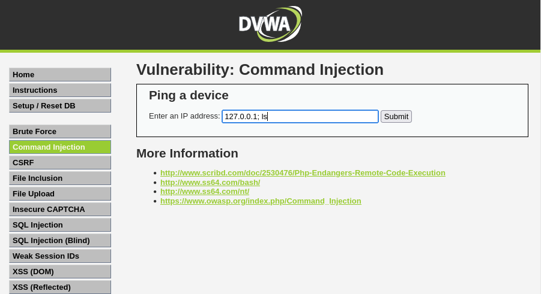
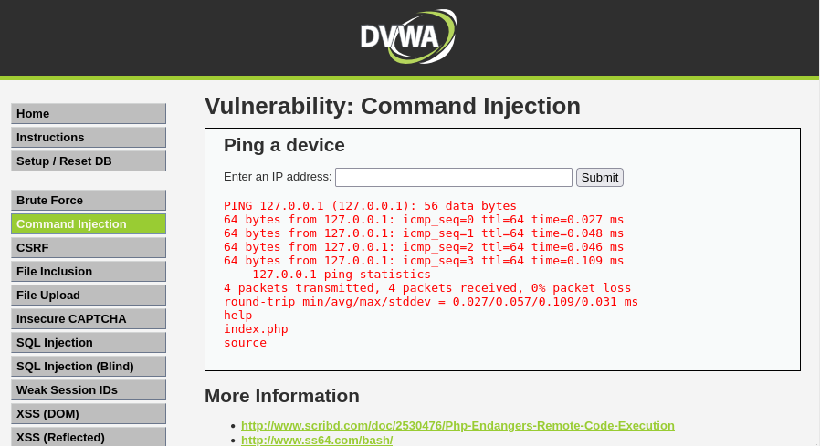
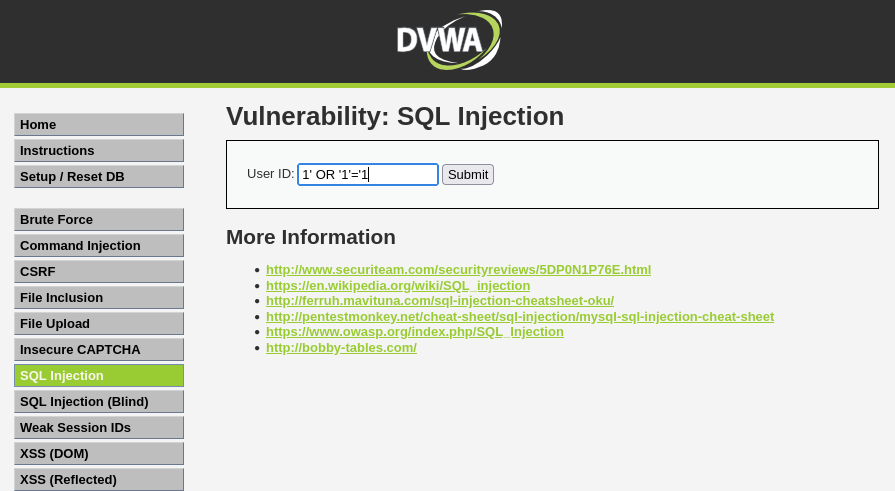
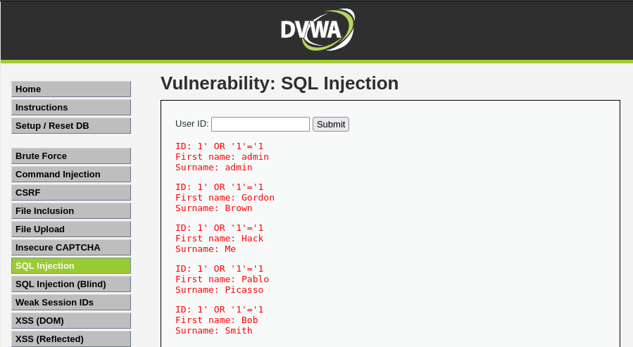
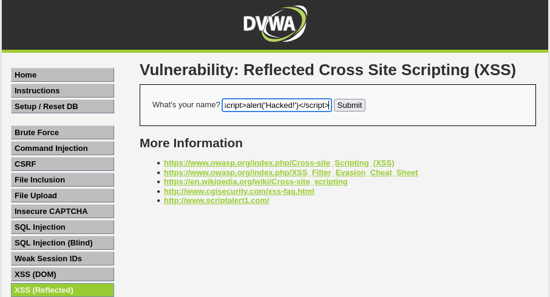
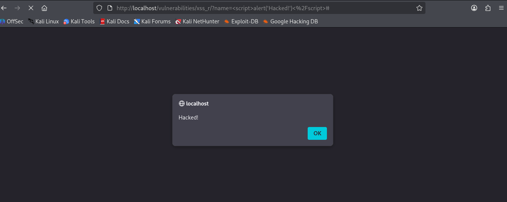

# 🔐 Cybersecurity Home Lab

[]()
[]()
[]()
[]()

## 📖 Overview

I built this cybersecurity home lab from scratch as a complete beginner to understand how web attacks work and how they appear on network traffic.

**What I built:**
- Kali Linux on VirtualBox (attacking machine)
- DVWA (Damn Vulnerable Web Application) using Docker (target)
- Performed 3 successful web attacks
- Monitored everything with Wireshark

## 🛠️ Tools Used

| Tool | Purpose |
|------|---------|
| VirtualBox | Run Kali Linux VM |
| Kali Linux | Attacking OS |
| Docker | Deploy DVWA container |
| DVWA | Vulnerable target |
| Wireshark | Network traffic capture |

## ⚔️ Attacks Performed (All Successful)

### 1. Command Injection ✅
**Payload:** `127.0.0.1; ls`

**What it does:** The server executed my `ls` command and showed directory contents.




### 2. SQL Injection ✅
**Payload:** `1' OR '1' = '1`

**What it does:** Displayed all users from the database instead of just one.




### 3. Cross-Site Scripting (XSS) ✅
**Payload:** `<script>alert('XSS')</script>`

**What it does:** JavaScript popup executed in the browser.




## 📡 Network Monitoring

### Wireshark Capture
Captured the exact HTTP requests containing my attack payloads.

**Filter used:** `http contains ";"`


### Docker Logs
Real-time logs showing attacks being recorded.

```bash
sudo docker logs -f <container_id>
